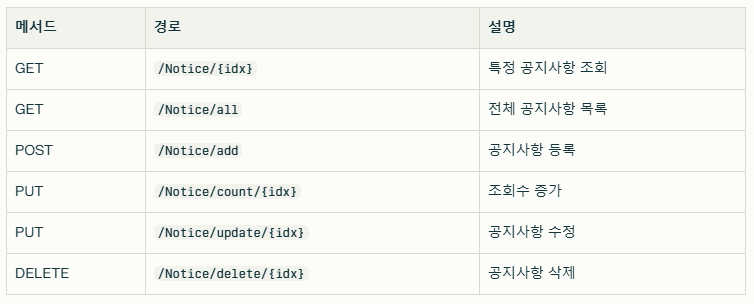
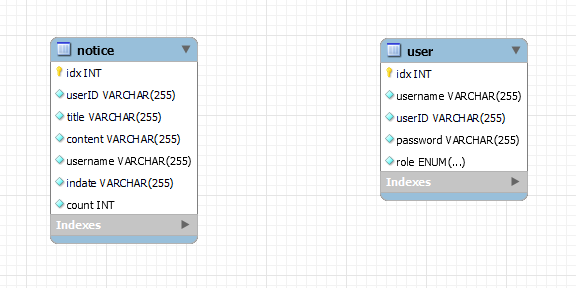

# StudyGroup_project
------------------
#### 1. 프로젝트 소개
#### 2. 기술 스택
#### 3. API 명세
#### 4. ERD
#### 5. 폴더 구조
#### 6. 후기

----

### 1. 프로젝트 소개 📌
##### : IF sutdy group의 웹 개발 동아리에서 동아리 소개 페이지 개발을 진행하였습니다.


### 2. 기술 스택 📖

##### [Front]  


##### [Back]
 [OpenJDK-17][v.3.5.3]

##### [DataBase]


##### [Testing]


##### [IDE]


### 3. API 명세 📃



### 4. ERD



### 5. 폴더 구조 📂
```
src
├─main
│ ├─java
│ │ └─com
│ │ └─studygroup
│ │ └─📁 study_project
│ │ ├─config
│ │ ├─controller
│ │ ├─entity
│ │ ├─mapper
│ │ └─service
│ ├─resources
│ └─webapp
│ ├─📁 resources
│ │ ├─css
│ │ ├─images
│ │ └─js
│ └─WEB-INF
│ └─📁 views
│ ├─common
│ ├─login
│ ├─noticeAdd
│ ├─noticeCheck
│ ├─noticeModify
│ └─register
└─test
└─java
└─com
└─studygroup
└─study_project
```

### 6. 후기 😋

##### : 매주 강의를 듣고 발표식으로 정리하면서 진행했는데도, 어려운 부분이 많았다. 특히 백엔드 부분의 Spring은 강의를 다시 한번 더 듣고 따라해봤는데도 어려웠다.. Sping은 강의를 계속 들으면서 복습하겠지만 자세하게 배울 기회가 생긴다면 열심히 들어야겠다..!!!